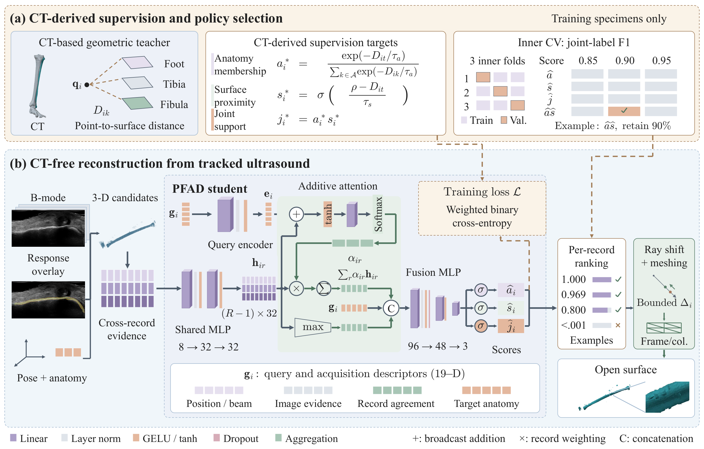

# PFAD

**Privileged First-Arrival Distillation for CT-Free Bone Surface Reconstruction From Tracked Ultrasound**

PFAD selects cortical surface support from tracked ultrasound sweeps. CT geometry supplies supervision on training specimens. At reconstruction, a compact student combines query context with evidence from other sweeps, ranks candidates within each record, and applies bounded depth correction before constructing an open surface.

This repository accompanies the manuscript and provides the implementation, specimen splits, frozen policies, study results, and scripts for reproducing the experiments.



## Installation

Python 3.10 is recommended for the complete reconstruction and registration workflow. Install the PyTorch build appropriate for your CPU or GPU, then install PFAD from this directory:

```bash
git clone https://github.com/wujia-xyz/PFAD.git
cd PFAD
python -m venv .venv
source .venv/bin/activate
python -m pip install --upgrade pip
python -m pip install -e '.[geometry,test]'
python -m pytest -q
pfad --help
```

The `geometry` extra supplies Open3D. The model and feature tests also work with `pip install -e '.[test]'`. See [the tested environments](docs/ENVIRONMENT.md) for the versions used in the study and release checks.

## Run a released model

The study uses the lower-limb release of [UltraBones100k](https://github.com/luohwu/UltraBones100k). Its released response masks and tracking records are the inputs to PFAD. Download one specimen for a small example:

```bash
python scripts/prepare_ultrabones_subset.py --specimen specimen01 --anatomy foot
python scripts/fetch_release.py models
pfad anchor \
  --dataset-root data/UltraBones100k \
  --specimen specimen01 --anatomy foot \
  --output outputs/specimen01_foot_features.npz
python scripts/infer.py \
  --features outputs/specimen01_foot_features.npz \
  --fold specimen01 \
  --output outputs/specimen01_foot_prediction.npz \
  --mesh outputs/specimen01_foot.ply
```

The `specimen01` model excludes specimen01 from fitting. Inference consumes the feature archive and the released model; it does not load a CT model. The saved `.ply` is an open surface in the tracked coordinate system, with distances in millimeters.

For an existing dataset, pass its root to `pfad anchor`. The experiment runners also accept the `PFAD_DATA_ROOT` environment variable. [Data preparation](docs/DATA.md) describes the required files, provenance, and directory layout.

## Reproduce the paper

Run commands from the repository root. The full study contains 14 specimens and three anatomies, evaluated by leaving each specimen out of model fitting and policy selection.

```bash
# Prepare ultrasound features and separate CT teacher archives for all cases.
python scripts/prepare_ultrabones_subset.py
python scripts/reproduce.py prepare

# Train outer models and select each policy using inner cross-validation.
python scripts/reproduce.py train --device cuda

# Reconstruct and evaluate frozen point sets and open surfaces.
python scripts/reproduce.py evaluate
```

The released original predictions support exact replay of the primary geometry results without retraining:

```bash
python scripts/fetch_release.py predictions
python scripts/reproduce.py evaluate --specimen specimen01 --anatomy foot
```

The [reproducibility guide](docs/REPRODUCIBILITY.md) covers the learned comparator, acquisition sensitivity, registration, original predictions, and the distinction between primary predictions and saved PFAD refits.

| Experiment | Entry point |
|---|---|
| Primary PFAD training and evaluation | `scripts/reproduce.py train` and `evaluate` |
| Nested Set Transformer comparator | `scripts/reproduce.py comparator` |
| Query-context ablations and additional seeds | `scripts/audits/pfad_tmi_revision/run_context_ablation.py` |
| Sweep, frame, and pose sensitivity | `scripts/reproduce.py sensitivity` |
| Retrospective rigid registration | `scripts/reproduce.py registration` |
| Acquisition sensitivity figure | `scripts/reproduce.py plot` |
| Stored point and surface comparison | `scripts/report_results.py` |

Use `--dry-run` with `reproduce.py` to inspect the commands before execution. The complete training and sensitivity experiments require the complete prepared cohort; a small example does not produce a paper-wide aggregate.

## Results and artifacts

The repository includes specimen-level results and the full acquisition summary in [`paper_results/`](paper_results). Versioned [study artifacts](https://github.com/wujia-xyz/PFAD/releases/tag/v1.0.0) provide:

- **Models:** 14 saved PFAD refits and 14 selected outer Set Transformer checkpoints, with their policies and fitting records.
- **Original predictions:** the 42 frozen PFAD prediction archives used for the primary point and surface results.
- **Results:** the complete case metrics for acquisition sensitivity and the completed primary and registration analyses.

`scripts/fetch_release.py` checks the archive and extracted file hashes against the committed manifest. The data preparation script obtains the original dataset from its authors; dataset ZIPs are not stored in this repository.

The two learned models have close observed mean geometry. PFAD has 15,203 parameters and the Set Transformer comparator has 181,379. Acquisition sensitivity is evaluated on point sets with models and policies held fixed. The registration experiment measures recovery of the released alignment under imposed perturbations. Consult the manuscript and result files for the comparison scope and statistical analysis.

Detailed feature definitions, model dimensions, normalization, and numerical settings are documented in [IMPLEMENTATION.md](docs/IMPLEMENTATION.md).

## Repository layout

```text
src/pfad/                 Core reconstruction implementation and command line
src/pfad_tcsvt/           Learned comparator and acquisition perturbations
scripts/                 Data, training, inference, evaluation, and plotting
configs/                 Frozen experimental protocols
paper_results/           Specimen-level results, policies, and release hashes
tests/                   Model, masking, perturbation, and aggregation checks
third_party/             Attributed Set Transformer reference module
docs/                    Data, implementation, and reproduction instructions
```

## Citation

Use **Cite this repository** on GitHub or the supplied [`CITATION.cff`](CITATION.cff) to cite this version of the software. The accompanying manuscript is titled *Privileged First-Arrival Distillation for CT-Free Bone Surface Reconstruction From Tracked Ultrasound*. Publication metadata will be added when available.

## License and dependencies

We use [UltraBones100k](https://github.com/luohwu/UltraBones100k), compare with an adapted [Set Transformer](https://github.com/juho-lee/set_transformer), and evaluate compatibility with [UltraBoneUDF](https://github.com/luohwu/UltraBoneUDF). Their authors retain the rights to their respective work. PFAD code is released under the [MIT License](LICENSE); dataset-derived material and third-party components are described in [NOTICE.md](NOTICE.md).

For reproducibility questions, please use GitHub Issues.
